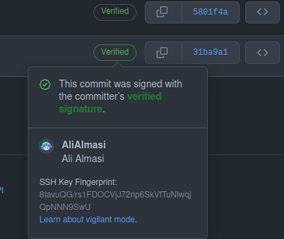

  

# What is "Verified" Git commits? How can I verify my Git commits?

These were the questions I asked myself when I saw "verified" commits on GitHub.

  

After lots of searching, I found out it is one of the most cool features of Git. So, I searched more to find out how can I sign my Git commits.

After weeks, I found out that GitHub has a complete (but complex) document on this.

I read the documentation and was finally able to do this on both GNU/Linux & Windows.  
Now I want to write a useful summary of GitHub documentation here for beginners so that I can help them in this regard.

*Using GPG or SSH, you can sign tags and commits. These tags or commits are marked as verified on GitHub so other people can be confident that the changes come from a trusted source.*

> Currently **GNU/Linux** is ready. Windows version will also be ready soon.

## Start reading!
[You can read the GNU/Linux version here.](./files/gnulinux.md)  
You can read the Windows version here.  

## Author
**[Ali Almasi](https://al1almasi.ir)**  
[GitHub profile](https://github.com/alialmasi)  
[Telegram channel](https://t.me/al_dot_dev)