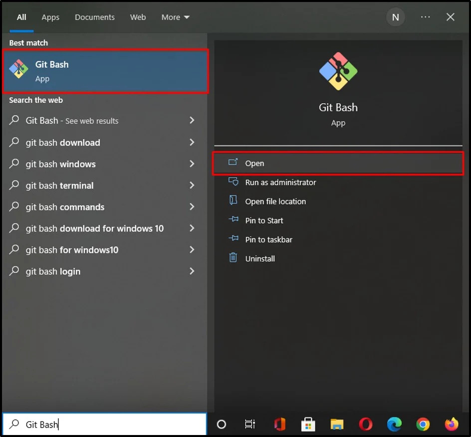

<h1>How to verify git commits</h1>
<h2>What is "verified" git commits? How can I verify my git commits?</h2>
 

 

These were the questions I asked myself when I saw "verified" commits on GitHub. After lots of searching, I found out it is one of the most cool features of git. So, I searched to find out how can I sign my git commits.

At first (on Windows) I didn't know that you can do it pretty easily on the Git bash. I gave it up because I thought it is impossible on Windows. I saw videos on YouTube doing this on Windows, but it was very confusing.

After weeks, I found out that the GitHub has a complete (but a little complex) document on this. <a href="https://docs.github.com/en/authentication/managing-commit-signature-verification/about-commit-signature-verification">Link</a>

I read the documentation and was finally able to do this on both Windows and Linux (as shown in picture above). Now I want to write a useful summary of GitHub documentation here for beginners so that I can help them in this regard.

<strong>We will do this on Windows (Git bash) first. We will do this through Linux family OS in a separate file.</strong>
<h2>1. Install git on Windows</h2>

You can donwload and install git from the official website.
 
 

After installing, you can see there will be a new program added "Git Bash".
 
 
